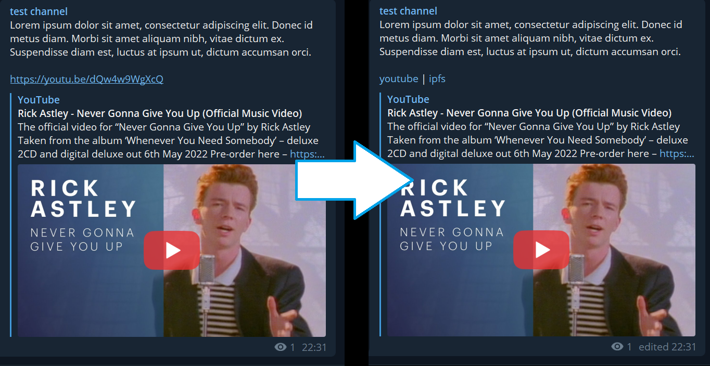

# Telegram IPFS archivator



## Workflow

1. This bot reads channel's posts
2. Gets first youtube link
3. Downloads youtube video via youtube-dl
4. Adds a folder with videos in ipfs
5. Create IPNS link (for link to be static, use your own key)

## Docker run example
```bash
docker run -t \
  -e API_TOKEN=your_telegram_api_token \
  -e CHANNEL_ID=your_channel_id \
  -e MAX_RETRIES=50 \
  -v ~/your/video/dir/:/root/storage \
  -v ~/your/ipfs/key.key:/root/key.key \
  -p 4001:4001 \
  -p 4001:4001/udp \
  thedmdim/telegram-ipfs-archiver
```
